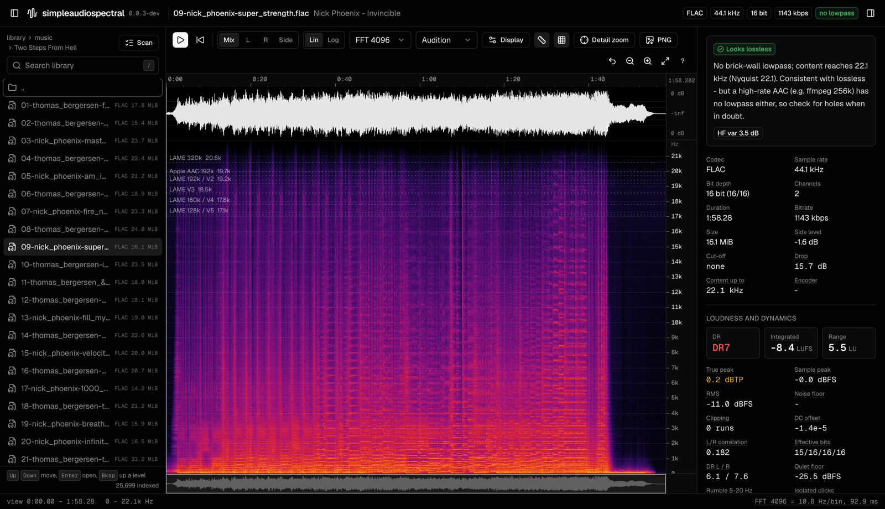
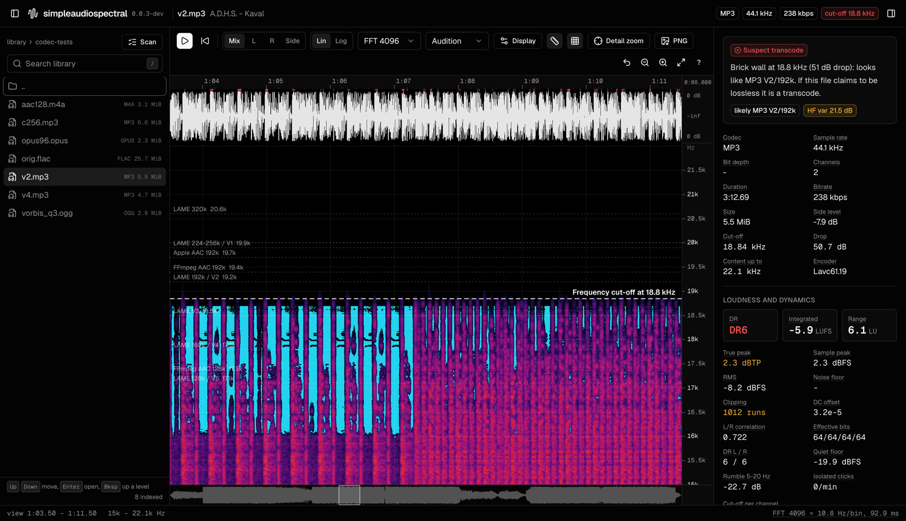
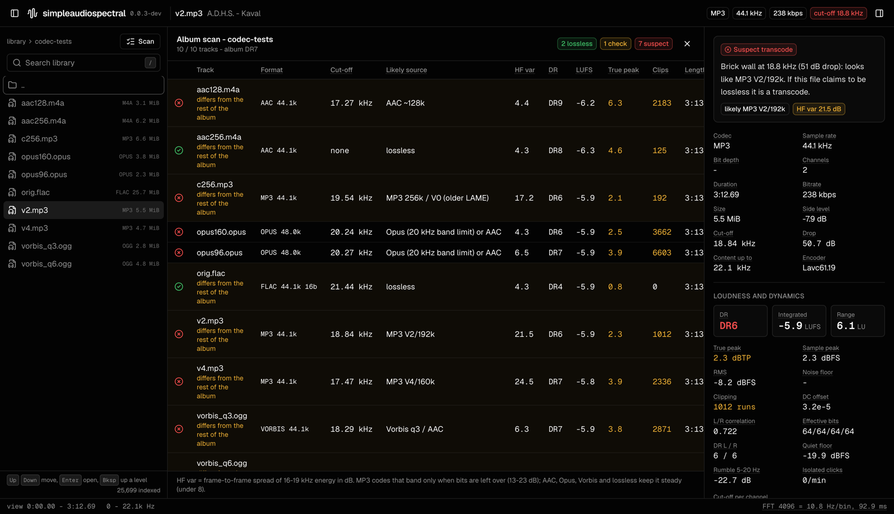
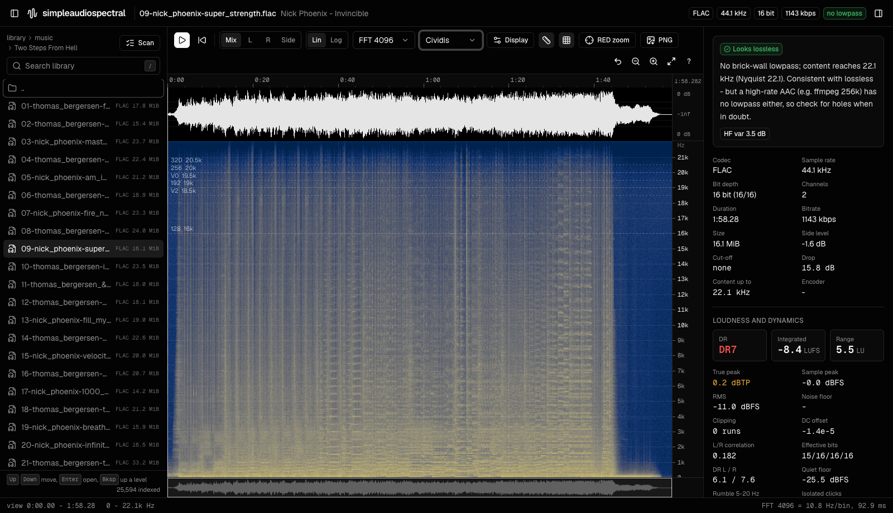

# simpleaudiospectral

**Fake FLAC detector and spectrogram viewer for lossless audio: find MP3/AAC transcodes, upsampled hi-res and padded bit depth, self-hosted in Docker.**

[](https://github.com/fishingpvalues/simpleaudiospectral/actions/workflows/ci.yml)
[](https://github.com/fishingpvalues/simpleaudiospectral/actions/workflows/ci.yml)
[](https://scorecard.dev/viewer/?uri=github.com/fishingpvalues/simpleaudiospectral)
[](https://github.com/fishingpvalues/simpleaudiospectral/releases)
[](https://github.com/fishingpvalues/simpleaudiospectral/pkgs/container/simpleaudiospectral)
[](https://github.com/fishingpvalues/simpleaudiospectral/attestations)
[](pyproject.toml)
[](https://github.com/astral-sh/ruff)
[](https://www.conventionalcommits.org)
[](renovate.json)
[](#ai-use)
[](LICENSE)

simpleaudiospectral is a self-hosted web application for checking whether
audio files are what they claim to be. Point it at a music library and it
shows a spectrogram, waveform and loudness analysis of any track, and flags
**fake lossless** files: FLAC, WAV or ALAC that were made from an MP3, AAC,
Opus or Vorbis file, "hi-res" 96/192 kHz files upsampled from CD, 24-bit
files padded from 16-bit, and clipped masters. It names the likely source
codec and bitrate (for example "MP3 V2/192k"), scans whole albums at once,
and runs in the browser on any device, with an HTTP API for scripts.

Its checks rest on encoder source code and published research on
fake-lossless detection, not on rules of thumb, which makes it usable for
the spectral reviews that curated lossless communities such as RED expect.
The viewer draws a zoomable spectrogram in the style of Adobe Audition, and
the tool exports the widely used SoX spectrogram image.

Licensed under the MIT license. See [LICENSE](LICENSE). If it saves you
time, a star on GitHub helps other people find it.



## Contents

- [Features](#features)
- [Quick start](#quick-start)
- [Configuration](#configuration)
- [How the verdict is reached](#how-the-verdict-is-reached)
- [Reference lines](#reference-lines)
- [Compared with other tools](#compared-with-other-tools)
- [FAQ](#faq)
- [Keyboard shortcuts](#keyboard-shortcuts)
- [Accessibility](#accessibility)
- [HTTP API](#http-api)
- [Development](#development)
- [Security](#security)
- [AI use](#ai-use)

## Features

**Viewer**

- Waveform and spectrogram with a time ruler, frequency axis and grid,
  rendered at the display's exact resolution for the visible range.
- Box zoom, wheel zoom around the cursor, separate frequency zoom, pan, an
  overview strip of the whole track, and a view history.
- Linear and logarithmic frequency scales. FFT sizes 512 to 32768.
  Blackman-Harris, Kaiser, Hann, Hamming and Blackman windows. An adjustable
  dB range.
- Mix, left, right and side (L-R) channel views.
- Reference lines where common encoder settings stop coding (LAME, FFmpeg
  and Apple AAC, libvorbis, Opus), taken from the encoders' source code and
  verified by measurement; each encoder can be switched on or off in the
  display settings. Commonly quoted rule-of-thumb values are available as an
  optional set. See [Reference lines](#reference-lines).
- The detected cut-off drawn on the plot.
- One-key detail zoom to the loudest 8 seconds of the top band, where
  lowpasses, shelves and holes are easiest to see.
- Overlays for spectral holes (bands a lossy encoder dropped in single
  frames) and the 99% spectral rolloff per frame.
- Cursor readout of time, frequency and level in dBFS, plus a live spectrum
  slice under the cursor.
- Playback with a playhead that follows the view. Formats the browser cannot
  play are transcoded to FLAC on the fly.
- PNG export of the current view, and SoX spectral export of the full track
  or the visible time range.

**Analysis**

- Brick-wall lowpass detection on the 90th-percentile spectrum, with the
  likely source codec named: MP3 by bitrate class, AAC, Opus or Vorbis.
- MP3 identification through sfb21 behaviour. This is the frame-to-frame
  variability of the band above 16 kHz, which separates MP3 from AAC, Opus
  and Vorbis at similar cut-offs.
- 16 kHz shelf detection.
- Detection of upsampled hi-res files, and of files resampled from a lower
  rate.
- Fake bit-depth checks: a per-bit usage histogram, SoX used/declared bit
  depth, and the noise floor of quiet passages.
- EBU R128 integrated loudness and loudness range, true peak and sample peak.
- DR score (TT DR Meter algorithm), including per channel.
- Clipping and flat-top detection with a clickable list of positions.
- DC offset, stereo correlation over time, a goniometer for the current
  view, and a per-channel cut-off comparison that exposes joint-stereo lossy
  coding.
- Hints for vinyl and other analogue sources: rumble and isolated clicks.
- CRT line-whine detection at 15.625 and 15.734 kHz, so a TV tone is not
  mistaken for a codec artifact.

**Library**

- Browses the mounted volumes and shows the disk usage of each.
- Searches the whole library instantly from a background index.
- Recently opened files, keyboard navigation and deep links to a file.
- Album scan streams a per-track table of verdicts, cut-offs, DR, loudness
  and true peak. It flags tracks that differ from the rest of the album,
  which is the usual sign of a mixed-source release.

**Security**

- Optional API key (`API_KEY` or a Docker secret via `API_KEY_FILE`) for the
  API and a login screen for the browser, with signed, expiring `HttpOnly`
  session cookies.
- Brute-force lockout per client, proxy-aware client addresses
  (`TRUSTED_PROXIES`), and log lines for fail2ban or CrowdSec.
- Strict security headers (CSP, frame and referrer policy), no version or
  host paths revealed while signed out, and connection and timeout limits.
- ffmpeg restricted to local files, so a disguised playlist in the library
  cannot make the server fetch URLs.
- A read-only, non-root container with all capabilities dropped. See
  [Security](#security).



## Quick start

Multi-arch images (linux/amd64, linux/arm64) are published to the GitHub
Container Registry for every release.

```sh
docker run -d --name simpleaudiospectral \
  --read-only --tmpfs /cache --tmpfs /tmp \
  --cap-drop ALL --security-opt no-new-privileges:true \
  -p 127.0.0.1:4748:4748 \
  -v simpleaudiospectral-pcm:/pcm \
  -v /path/to/music:/library/music:ro \
  ghcr.io/fishingpvalues/simpleaudiospectral:latest
```

Open `http://127.0.0.1:4748`. This publishes the port on loopback only and
has no authentication, which is right for a single machine. To reach it from
other devices, read [Exposing it beyond localhost](#exposing-it-beyond-localhost)
first.

| Tag | Meaning |
|---|---|
| `0.0.2`, `0.0` | A release, and the newest release of that line |
| `latest` | The newest release |
| `beta`, `sha-<commit>` | The current `main` branch, built on every push |

To build from source instead:

```sh
docker build -t simpleaudiospectral https://github.com/fishingpvalues/simpleaudiospectral.git#main
```

### Docker Compose

```yaml
services:
  simpleaudiospectral:
    image: ghcr.io/fishingpvalues/simpleaudiospectral:latest
    container_name: simpleaudiospectral
    user: "1000:1000"
    read_only: true
    cap_drop: [ALL]
    security_opt: ["no-new-privileges:true"]
    tmpfs:
      - /cache:size=256m,uid=1000,gid=1000
      - /tmp:size=64m,mode=1777
    ports:
      - "127.0.0.1:4748:4748" # loopback only; see "Exposing it beyond localhost"
    environment:
      PCM_DISK_GB: "20"
    volumes:
      - pcm:/pcm
      - /path/to/music:/library/music:ro
      - /path/to/rips:/library/rips:ro
    restart: unless-stopped
    deploy:
      resources:
        limits:
          memory: 1536M
          pids: 256

volumes:
  pcm:
```

```sh
docker compose up -d
```

Each directory mounted under `/library` appears as a volume in the library
browser. All mounts can and should be read-only; the application never
writes to the library.

### Exposing it beyond localhost

On the LAN, over the internet or to other people, require a key and put
HTTPS in front. The compose file below keeps the app off every host port,
reads the key from a Docker secret and serves it through Caddy, which
obtains a certificate automatically; any other reverse proxy works the same
way (see [Behind a reverse proxy](#behind-a-reverse-proxy)).

```sh
mkdir -p secrets && openssl rand -hex 32 > secrets/sas_api_key && chmod 600 secrets/sas_api_key
```

```yaml
services:
  simpleaudiospectral:
    image: ghcr.io/fishingpvalues/simpleaudiospectral:latest
    user: "1000:1000"
    read_only: true
    cap_drop: [ALL]
    security_opt: ["no-new-privileges:true"]
    tmpfs:
      - /cache:size=256m,uid=1000,gid=1000
      - /tmp:size=64m,mode=1777
    # No ports: only the proxy reaches it, on the internal network.
    environment:
      API_KEY_FILE: /run/secrets/sas_api_key
      TRUSTED_PROXIES: "172.30.0.0/24" # the backend network below
    secrets: [sas_api_key]
    volumes:
      - pcm:/pcm
      - /path/to/music:/library/music:ro
    networks: [backend]
    restart: unless-stopped
    deploy:
      resources:
        limits:
          memory: 1536M
          pids: 256

  caddy:
    image: caddy:2
    ports: ["80:80", "443:443"]
    command: caddy reverse-proxy --from spectral.example.com --to simpleaudiospectral:4748
    volumes:
      - caddy-data:/data
    networks: [backend, default]
    restart: unless-stopped

networks:
  backend:
    internal: true # no route to the internet from the app
    ipam:
      config:
        - subnet: 172.30.0.0/24

secrets:
  sas_api_key:
    file: ./secrets/sas_api_key

volumes:
  pcm:
  caddy-data:
```

Then open `https://spectral.example.com` and enter the key once; the browser
keeps a session for 30 days. Scripts send the key in a header:

```sh
curl -s -H "Authorization: Bearer $(cat secrets/sas_api_key)" https://spectral.example.com/api/health
```

Checklist for a public instance:

- `API_KEY` or `API_KEY_FILE` set, 32 or more random characters.
- HTTPS in front; plain HTTP exposes the key and the session cookie.
- `TRUSTED_PROXIES` set to the proxy's address or network, so the lockout
  sees real client addresses.
- The app itself on no public port: loopback or an internal network only.
- Library mounts read-only; the container read-only, non-root, with all
  capabilities dropped.
- The `auth failure from` log lines fed to fail2ban or CrowdSec if you use
  one, and a current image (Renovate or a similar updater).

## Configuration

| Variable | Default | Purpose |
|---|---|---|
| `LIBRARY_ROOT` | `/library` | Root of the browsable library. |
| `PORT` | `4748` | Listening port inside the container. |
| `CACHE_DIR` | `/cache` | SoX PNG cache. A tmpfs is sufficient. |
| `PCM_DIR` | `/pcm` | Disk cache of decoded audio, memory-mapped. Mount a volume here. |
| `PCM_DISK_GB` | `20` | Size limit of that cache; the least recently used files go first. |
| `MAX_JOBS` | `3` | Concurrent decode and analysis jobs. |
| `INDEX_INTERVAL` | `900` | Seconds between rebuilds of the search index. |
| `ACCESS_LOG` | unset | Set to any value to log requests. |
| `API_KEY` | unset | Require this key on every API request (16+ characters). Unset means no authentication. |
| `API_KEY_FILE` | unset | Read the key from this file instead, e.g. a Docker secret. |
| `TRUSTED_PROXIES` | unset | Comma-separated addresses or CIDRs of reverse proxies whose `X-Forwarded-For` and `X-Forwarded-Proto` are believed. Set it whenever a proxy is in front. |
| `MAX_CONNECTIONS` | `128` | Open connections at once; more are closed immediately. |
| `LOCKOUT_FAILS` / `LOCKOUT_WINDOW` | `5` / `300` | Wrong-key lockout: failures per client before a `Retry-After` window. |
| `CODE_LOCKOUT_FAILS` / `CODE_LOCKOUT_WINDOW` | `5` / `300` | Wrong two-factor code lockout, per client; independent of the key lockout. |
| `TOTP_FILE` | `/pcm/.totp` | Where the two-factor secret is stored (mode 0600). |

Every file is decoded once to 32-bit float PCM on disk and memory-mapped, so
memory does not grow with the length of a file; a three-hour DJ set was
measured at 73 MiB of heap in a 1.5 GB container. Without a volume on `/pcm`
the cache falls back to `/cache`, which is usually a tmpfs and therefore RAM.

## Accuracy

Every measurement covers the whole file: every frame, every block, every
sample. Nothing is sampled, capped or estimated.

- **Precision.** Samples are decoded to 32-bit float, which represents every
  16-bit and 24-bit PCM value exactly. All analysis (FFT, levels,
  percentiles, sums) runs in 64-bit float. For comparison, Adobe Audition and
  Audacity process audio in 32-bit float.
- **Proof.** `tests/test_exact.py` computes each measurement a second time as
  its textbook whole-array definition and requires the same result, with a
  deliberately awkward chunk size. Per-frame and per-block values,
  percentiles, histograms and counts are bit-identical; whole-file sums agree
  to float64 rounding (about 1e-15 relative). The file analysis is tested
  against the direct functions the same way.
- **Reference implementations.** Integrated loudness, loudness range and true
  peak (4x oversampled, ITU-R BS.1770-4) come from ffmpeg's `ebur128` filter,
  run over the entire decoded file.
- **Percentiles need every value.** The per-bin percentiles of the spectrum
  are taken over all analysed frames; for long files those values are
  written to disk and sorted there, which is why the first analysis of a long
  file takes minutes rather than seconds. The result is stored next to the
  decoded audio, so each file is analysed once per version.

## How the verdict is reached



A lossy encoder removes everything above a fixed lowpass in every frame. On
a spectrogram this shows as a flat, constant edge. A lossless recording
tapers into a noise floor that reaches the Nyquist frequency. The tool finds
the steepest level drop above 10 kHz in the 90th-percentile spectrum, then
uses further evidence to name the source:

| Measured on one master | Cut-off | HF variability |
|---|---|---|
| Lossless (CD) | none, reaches 22.05 kHz | 3.2 dB |
| MP3 V4 (LAME) | 17.5 kHz | 23.5 dB |
| MP3 V2 | 18.8 kHz | 15.3 dB |
| MP3 256 kbps | 19.5 kHz | 11.2 dB |
| AAC 128 kbps | 17.3 kHz | 3.4 dB |
| Opus 96 and 160 kbps | 20.2 to 20.3 kHz | 3.2 to 4.3 dB |
| Vorbis q3 | 18.3 kHz | 3.3 dB |
| Vorbis q6 | 21.2 kHz | 3.3 dB |

HF variability is the standard deviation, over short frames, of the energy
from 16 to 19 kHz relative to 12 to 16 kHz. LAME codes that band (sfb21)
only when bits are left over, so its level jumps from frame to frame. Other
codecs keep it steady.

Limits worth knowing:

- A spectrum cannot identify every lossy source. ffmpeg's AAC encoder at
  256 kbps applies no lowpass at all and looks lossless on a spectrogram.
- LAME `-V 0` has had no lowpass filter since 3.99 (its own `--verbose`
  output says "polyphase lowpass filter disabled"). Its top end is limited
  only by bit allocation, so it varies with the material and can sit at or
  above the 20.6 kHz of 320 kbps; the two cannot be told apart by lowpass
  alone.
- Old ADD masters can top out near 16 kHz. A master rolls off softly, while
  a codec edge is flat and constant; the zoom view shows the difference.

The verdict is evidence for a human reviewer, not a replacement for one.

The method follows the published work on the problem: a lossy encoder leaves
a band cut and time-frequency holes in the spectrogram
([Hennequin et al., ICASSP 2017](https://research.deezer.com/publication/2017/04/05/icassp-hennequin.html)),
and the high-frequency spectrum of a transcode reveals the bitrate it was
first encoded at
([D'Alessandro and Shi, ACM MM&Sec 2009](https://dl.acm.org/doi/10.1145/1597817.1597828);
[Yang, Shi and Huang, ACM MM&Sec 2009](https://dl.acm.org/doi/10.1145/1597817.1597838)).

## Reference lines

The lines on the spectrogram (key `R`) mark where an encoder setting stops
coding. A lowpass is a fixed property of the encoder, so each value comes
from the encoder's source code or its own diagnostic output, and each was
checked by encoding 20 s of white noise at 44.1 kHz and measuring the edge
with this tool. Choose the encoders in the display settings; MP3, AAC and
Opus are on by default.

| Encoder and setting | Line | Source | Measured edge |
|---|---|---|---|
| LAME 128 kbps, V5 | 17.1 kHz | transition band 16.54 to 17.07 kHz | 16.8 kHz |
| LAME 160 kbps, V4 | 17.8 kHz | 17.25 to 17.78 kHz | 17.5 kHz |
| LAME V3 | 18.5 kHz | 17.96 to 18.49 kHz | 18.2 kHz |
| LAME 192 kbps, V2 | 19.2 kHz | 18.67 to 19.21 kHz | 18.8 to 18.9 kHz |
| LAME 224 and 256 kbps, V1 | 19.9 kHz | 19.38 to 19.92 kHz | 19.5 to 19.6 kHz |
| LAME 320 kbps | 20.6 kHz | 20.09 to 20.63 kHz | 20.3 kHz |
| LAME V0 | none | lowpass disabled since 3.99 | 21.4 kHz |
| FFmpeg AAC 128 kbps | 17.3 kHz | `AAC_CUTOFF_FROM_BITRATE`, bitrate per channel | 17.3 kHz |
| FFmpeg AAC 192 kbps | 19.4 kHz | same formula | 19.4 kHz |
| FFmpeg AAC 256 kbps and up | none visible | same formula, capped near Nyquist | 21.6 kHz |
| Apple AAC 128 kbps | 18.6 kHz | closed source, measured | 18.6 kHz |
| Apple AAC 192 kbps | 19.7 kHz | measured | 19.7 kHz |
| Vorbis q0, q2, q3, q4, q5 | 15.1, 16.5, 17.2, 18.9, 20.1 kHz | `_psy_lowpass_44` | 15.2, 16.6, 17.3, 19.0, 20.4 kHz |
| Vorbis q6 and up | none | same table | 21.4 kHz |
| Opus, any music bitrate | 20 kHz | fullband is 20 kHz audio bandwidth | 20.1 to 20.3 kHz |

Sources: LAME `libmp3lame/lame.c` (`optimum_bandwidth()` and the VBR table,
identical in 3.99.5, 3.100 and 4.0) with the transition bands printed by
`lame --verbose`; FFmpeg `libavcodec/psymodel.h` and `aacenc.c`; libvorbis
`lib/modes/psych_44.h`; Opus [RFC 6716](https://www.rfc-editor.org/rfc/rfc6716)
section 2 and the libopus bandwidth thresholds. Apple's AudioToolbox encoder
is closed, so its values are measurements only. The line is drawn at the top
of the transition band, where content ends; the analyser's cut-off sits a
little lower, in the middle of the steepest drop.

Music confirms the noise measurements for LAME, AAC and Opus to within
0.05 kHz (LAME V2 18.84, V4 17.47, 256 kbps 19.54, FFmpeg AAC 128 kbps 17.27,
Opus 20.24 to 20.27 kHz, measured on the same master). Vorbis is the
exception: its table value is where its noise shaping starts rather than a
hard filter, so on music the edge can sit about 1 kHz higher (q3: 17.3 kHz on
noise, 18.3 kHz on that master). Treat the Vorbis lines as a lower bound.

The round figures quoted in many spectral-check guides (16, 18.5, 19, 19.5,
20 and 20.5 kHz) are available as the optional "Rule-of-thumb values" set.
They are off by default: they differ from the encoder data by up to 1 kHz,
and "V0 at 19.5 kHz" only holds for LAME 3.98 and older.

## Compared with other tools

| | simpleaudiospectral | Spek | Fakin' The Funk | Lossless Audio Checker |
|---|---|---|---|---|
| Runs as | web app (Docker), any device | desktop app | Windows app | desktop / command line |
| Open source | yes (MIT) | yes (GPL) | no | no |
| Spectrogram viewer | zoomable, per channel, overlays | yes | yes | no |
| Automatic verdict and likely codec | yes | no | yes | yes |
| Whole-album scan | yes | no | yes | yes |
| Loudness, DR, clipping, bit depth | yes | no | no | no |
| HTTP API | yes | no | no | no |

The other tools are good at what they do; this one is for a library on a
server or NAS that you want to check from a browser, with the evidence for
each verdict on screen.

## FAQ

### How do I check if a FLAC file is fake or a transcode?

Open it. A lossy encoder cuts everything above a fixed frequency in every
frame, which shows as a flat edge in the spectrogram; genuine CD audio
reaches 22 kHz with a soft roll-off. The analysis panel names the edge
("Lowpass at 18.8 kHz, 49 dB drop: MP3 V2/192k.") and the reference lines
show which encoder settings end there. Use Scan on a folder to check a whole
album.

### Can it tell MP3 from AAC or Opus at the same cut-off?

Usually. LAME codes the band above 16 kHz only when bits are left over, so
its level jumps from frame to frame (HF variability above 13 dB), while AAC,
Opus and Vorbis keep it steady. Opus always ends at 20 kHz, its fullband
limit.

### What can it not detect?

A transcode from a lossy file without a lowpass: FFmpeg AAC at 256 kbps and
up, Vorbis q6 and up, and LAME V0 since 3.99 reach close to 22 kHz. Use the
spectral holes overlay and your ears for those. A master can also be band
limited on purpose (some old CDs stop near 16 kHz); a master rolls off
softly, a codec edge is flat.

### How do I detect fake hi-res (upsampled 24/96 or 24/192)?

The analysis compares the band above 24 kHz with the audible band; an
upsampled file has nothing up there, and the tool reports the rate it was
probably resampled from. Padded bit depth shows in the bit-usage histogram:
a 16-bit master in a 24-bit file leaves the low 8 bits at zero.

### Does it upload or modify my music?

No. Everything runs on your server, the library is mounted read-only, and
the page loads nothing from third-party hosts.

### Is it safe to expose on the internet?

With `API_KEY` set and HTTPS in front, yes; see
[Exposing it beyond localhost](#exposing-it-beyond-localhost) and
[Security](#security).

### Is it good enough for private music trackers' spectral checks?

It produces the usual evidence (full and zoomed spectrograms, the SoX
spectrogram image, cut-off and codec estimate), based on encoder data rather
than rules of thumb. Each community's own rules still decide.

## Keyboard shortcuts

| Key | Action |
|---|---|
| `Space` | Play or pause |
| `/` | Search the library |
| `Up` `Down` `Enter` `Backspace` | Move, open, go up a level in the library |
| drag, `Shift`+drag | Box zoom, pan |
| wheel, `Alt`+wheel | Zoom time, zoom frequency |
| `+` `-` `F` | Zoom in, zoom out, fit the whole track |
| `Left` `Right` | Pan |
| `Backspace` or `U` | Previous view |
| `Z` | Detail zoom |
| `L` | Linear or logarithmic frequency scale |
| `1` `2` `3` `4` | Mix, left, right, side |
| `R` `G` `H` `O` | Reference lines, grid, holes, rolloff |
| `E` | Export the view as PNG |

## Accessibility

**Colour vision.** The default map reproduces Adobe Audition's spectral
display: black, indigo, violet, magenta-red, orange, yellow, white. Maps
chosen for colour-vision deficiency are available as well:

- cividis, designed for deuteranopia and protanopia;
- viridis, magma and inferno, which are perceptually uniform;
- grayscale.

Overlay accents switch colour to stay visible on the selected map.
Verdicts never rely on colour alone; every state carries a text label and
an icon.



**Screen readers.** The layout uses landmarks: library navigation, the
spectrogram, the analysis panel and the cursor readout. Every canvas is
exposed as an image with a text description of what it shows, including the
visible range and the detected cut-off. A polite live region announces the
verdict when a file loads and the view once a zoom or pan settles. All icon
buttons are labelled. The spectrogram, library rows and album scan rows are
keyboard focusable, and a skip link leads straight to the spectrogram.

## HTTP API

The web interface is a client of a small JSON and binary API that can also
be scripted. Every `path` parameter is relative to `LIBRARY_ROOT`.

| Endpoint | Returns |
|---|---|
| `GET /api/ls?path=` | Folders and audio files, with size and modification time |
| `GET /api/roots` | Top-level volumes and their disk usage |
| `GET /api/search?q=&limit=` | Matches from the library index |
| `GET /api/info?path=` | Metadata and the lowpass, codec and hi-res analysis |
| `GET /api/stats?path=` | Loudness, true peak, DR, clipping, bit usage, stereo and per-channel data |
| `GET /api/scan?path=` | One NDJSON line per track in a folder, streamed as each finishes |
| `GET /api/stft?path=&t0=&t1=&f0=&f1=&cols=&rows=&fft=&win=&scale=&ch=` | A uint8 dB matrix for a viewport, with metadata in `X-Meta` |
| `GET /api/wave?path=&t0=&t1=&cols=&ch=` | Min and max peaks per column as float32 |
| `GET /api/gonio?path=&t0=&t1=&size=` | Goniometer density |
| `GET /api/audio?path=[&format=flac]` | The file with Range support, or a FLAC transcode |
| `GET /api/spectrogram?path=&start=&dur=&ch=` | SoX spectral PNG |

With `API_KEY` set, every endpoint except `/api/health`, `/api/login` and
`/api/logout` answers `401` without the key. Send it as
`Authorization: Bearer <key>` or `X-API-Key: <key>`. The web interface asks
for the key once and trades it for a session cookie through
`POST /api/login`. The key is never read from the query string, where it
would end up in proxy and access logs.

```sh
curl -s -H "Authorization: Bearer $API_KEY" 'http://127.0.0.1:4748/api/info?path=music/Artist/Album/01.flac' | jq .analysis.verdict
curl -sN 'http://127.0.0.1:4748/api/scan?path=music/Artist/Album'
```

## Development

The backend is the Python package `src/simpleaudiospectral` (numpy, ffmpeg
and SoX), managed with [uv](https://docs.astral.sh/uv/) in the layout of
[copier-astral](https://github.com/ritwiktiwari/copier-astral). The frontend
in `web/` is React, TypeScript, Vite and Tailwind CSS with Radix-based
components. Everything is bundled into the image, fonts included, so the page
loads nothing from third-party hosts. [CONTRIBUTING.md](CONTRIBUTING.md) maps
the code and says where a change goes.

```sh
make install            # uv sync and npm ci
make web                # build the UI into web/dist
make dev                # API on :4748 against ./library, Vite dev server on :5173
make verify             # ruff, ty, prettier, eslint, tsc and vitest, changing nothing
make test               # pytest: DSP, analysis, HTTP and auth (needs ffmpeg and sox)
make e2e                # Playwright: the built UI in a browser against a generated library
make fix                # format and autofix everything
make hooks-install      # lefthook: format on commit, Conventional Commits, check on push
```

The tests generate their own audio and need no network.

| Area | Tool |
|---|---|
| Python dependencies and build | uv, hatchling |
| Python lint, format, types | ruff, ty |
| Python tests | pytest, branch coverage via pytest-cov |
| Web lint, format, types | eslint (typescript-eslint, react-hooks, jsx-a11y), prettier, tsc |
| Web tests | vitest (units), Playwright (end to end) |
| Container | hadolint, Trivy, multi-arch buildx, SBOM and provenance attestations |
| Supply chain | actions pinned by commit, OpenSSF Scorecard, gitleaks |
| Dependencies | Renovate |

### Releases

Versions follow `0.0.x` while the project is pre-1.0. Commits on `main` use
[Conventional Commits](https://www.conventionalcommits.org/).
[release-please](https://github.com/googleapis/release-please) collects them
into a release pull request that updates `CHANGELOG.md` and the version.
Merging that pull request tags the release. The tag builds and pushes the
GHCR image with an SBOM and build provenance attestation. See
[CONTRIBUTING.md](CONTRIBUTING.md).

## Security

### Choosing an exposure

| Setup | What to set |
|---|---|
| Only you, on this machine or a VPN | Nothing. Publish the port on loopback or the VPN interface only. |
| An authenticating proxy in front (SSO, basic auth, forward auth) | Nothing required; `API_KEY` as a second layer does not hurt. |
| Reachable from the LAN or the internet | `API_KEY`, HTTPS in front, and `TRUSTED_PROXIES` for that proxy. A complete compose file is in [Exposing it beyond localhost](#exposing-it-beyond-localhost). |

Without `API_KEY` there is no authentication at all, and anyone who reaches
the port can browse and play the whole library. Never publish it on a public
address without either `API_KEY` or an authenticating proxy.

### What `API_KEY` does

These are the patterns common to self-hosted apps with an API key, such as the
*arr apps, Jellyfin, Immich, Grafana, Home Assistant and Paperless-ngx, applied
here:

- **One key, in a header only.** `Authorization: Bearer` or `X-API-Key`,
  compared in constant time. A `?apikey=` query parameter is not accepted,
  because URLs are written to proxy and access logs.
- **Short keys are refused.** The server does not start with a key under 16
  characters and warns under 32. Generate one with `openssl rand -hex 32`.
  `API_KEY_FILE` reads it from a Docker secret, so it stays out of
  `docker inspect` and the environment.
- **Sessions for the browser.** `POST /api/login` sets an `HttpOnly`,
  `SameSite=Strict` cookie scoped to `/api`. Its value is an expiry date
  signed with the key (HMAC-SHA256), not the key itself. The server enforces
  the 30-day expiry, and changing the key ends every session. The cookie is
  marked `Secure`, and `Strict-Transport-Security` is sent, only when the
  `X-Forwarded-Proto: https` header comes from a trusted proxy (the app itself
  never sees TLS when a proxy terminates it, so the proxy has to say).
  Signing out revokes the session on the server; to revoke every session,
  change the key.
- **Brute-force lockout.** After 5 wrong keys within 5 minutes, a client gets
  `429` with `Retry-After` until the oldest failure is 5 minutes old; the
  correct key is refused too in that time, and a browser that already has a
  valid session keeps working. An IPv6 `/64` counts as one client. Nothing
  sleeps, so a flood of guesses holds no threads.
- **Two-factor for the browser.** `POST /api/login` takes `{"key", "code"}`:
  the key proves who you are, and when a two-factor secret is enrolled (via
  `POST /api/twofa/setup` and `/verify`, both behind the API key) the
  six-digit code from an authenticator app proves a person is at the
  keyboard. The API key alone still opens every API route, exactly like the
  *arr apps; the code only gates the browser session. A wrong code does not
  feed the key lockout, but it has its own per-client lockout (5 wrong codes
  within 5 minutes), so a leaked key cannot brute-force the code online.
  Disarming two-factor also needs a live code.
- **Client addresses behind a proxy.** `X-Forwarded-For` is ignored unless
  the connection comes from an address in `TRUSTED_PROXIES`, so a client
  cannot forge its way around the lockout. The client is then the last hop
  that is not a trusted proxy. Without the setting behind a proxy, all
  clients share the proxy's address and one person's wrong keys lock out new
  logins for everyone for 5 minutes.
- **Log lines for fail2ban and CrowdSec.** Every failure writes
  `auth failure from <address>: <method> <path>` to stderr, whether or not
  `ACCESS_LOG` is set.
- **Cross-site requests.** `POST` requests that a browser marks as coming from
  another site (`Sec-Fetch-Site`) are refused, which stops login and logout
  forgery. No CORS headers are sent, so other sites cannot read API responses.
- **Nothing to fingerprint while signed out.** `/api/health` reports only that
  a key is needed; the version appears after sign-in. The `Server` header
  names no Python version, and error messages omit host paths. The UI bundle
  itself is public and contains no library data.

### Hardening that applies either way

- **HTTP headers.** A strict `Content-Security-Policy` (scripts from the
  bundle only, `frame-ancestors 'none'`), `X-Frame-Options: DENY`,
  `X-Content-Type-Options: nosniff`, `Referrer-Policy: no-referrer`,
  cross-origin isolation headers and a restrictive `Permissions-Policy`.
  `Strict-Transport-Security` is sent behind an HTTPS proxy.
- **Slow and many connections.** Each read or write may stall for 60 seconds
  at most, and connections beyond `MAX_CONNECTIONS` are closed at once. A
  public instance should still sit behind a proxy that rate-limits.
- **Untrusted files.** Library files often come from downloads. ffmpeg and
  ffprobe only open local files and pipes (`-protocol_whitelist file,pipe`),
  so a file that is really a playlist cannot make the server fetch URLs.
  Keep the image current for decoder fixes; Renovate and the Trivy gate in CI
  are there for that.
- **Paths.** Every path is resolved with `realpath` and confined to
  `LIBRARY_ROOT`, so a symbolic link cannot escape it.
- **Container.** A non-root user on a read-only root filesystem with all
  capabilities dropped and `no-new-privileges`; the library mounts are
  read-only and the only writable locations are `/pcm` and two tmpfs mounts.
  The application needs no outbound network, so an internal-only Docker
  network is fine.

### Behind a reverse proxy

Any proxy works as long as it forwards `X-Forwarded-For` and
`X-Forwarded-Proto` and does not buffer the streamed endpoints. With nginx:

```nginx
location / {
    proxy_pass http://127.0.0.1:4748;
    proxy_set_header X-Forwarded-For $proxy_add_x_forwarded_for;
    proxy_set_header X-Forwarded-Proto $scheme;
    proxy_buffering off;          # /api/scan streams, /api/audio seeks
    proxy_read_timeout 600s;      # the first analysis of a long file takes a while
}
```

Caddy sets both headers and streams responses by default:

```caddyfile
spectral.example.com {
    reverse_proxy 127.0.0.1:4748
}
```

Traefik also sets both headers; with Docker labels:

```yaml
    labels:
      - traefik.enable=true
      - traefik.http.routers.sas.rule=Host(`spectral.example.com`)
      - traefik.http.routers.sas.entrypoints=websecure
      - traefik.http.routers.sas.tls.certresolver=letsencrypt
      - traefik.http.services.sas.loadbalancer.server.port=4748
```

Then set `TRUSTED_PROXIES` to the address the proxy connects from: for
example `127.0.0.1` for a proxy on the same host, or the Docker network it
shares with the app, such as `172.18.0.0/16`. Do not add a network that
untrusted clients can connect from, or they could set their own
`X-Forwarded-For` and `X-Forwarded-Proto`. Both headers are believed only
from trusted peers: `X-Forwarded-For` decides which client a lockout counts,
`X-Forwarded-Proto` decides whether the session cookie gets `Secure` and
whether `Strict-Transport-Security` is sent.

**Tailscale serve** is the simplest internet-grade front: it terminates TLS
on the tailnet, proxies to a loopback port, and strips the `Tailscale-*`
identity headers of forged requests. The app then sees every connection as
coming from `127.0.0.1`, so set `TRUSTED_PROXIES: "127.0.0.1"` and
`API_KEY`; publish the port on loopback only. Note that `tailscale serve`
does not forward `X-Forwarded-Proto`, so the cookie is not marked `Secure`
in this setup - which is fine, because the tailnet connection is TLS and the
cookie is `SameSite=Strict` and `HttpOnly` either way.

An authenticating proxy (forward auth, single sign-on, basic auth) can stand
in for `API_KEY`. The app then trusts whoever the proxy lets through, so keep
its port closed to everything but the proxy.

Report vulnerabilities privately; see [SECURITY.md](SECURITY.md).

## AI use

This project is written with AI assistance. Most of the code, tests and
documentation were drafted with [Claude Code](https://claude.com/claude-code)
(Anthropic's Claude models), under the direction and review of the
maintainer, who decides what is merged and is responsible for it. Commits
where the model contributed carry a `Co-Authored-By: Claude` trailer.

The measurements are not taken on trust: `tests/test_exact.py` checks every
streamed measurement against a whole-array reference, the reference table in
[How the verdict is reached](#how-the-verdict-is-reached) comes from files
encoded and measured for it, and CI runs the full test suite, linters and a
container scan on every change.
